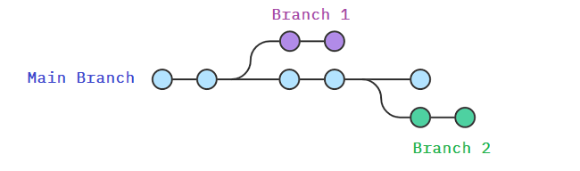
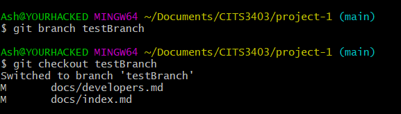

# Github

Github is a cloud-based service for storing and managing code. It allows us to track and control changes to code.

## Why is it important to us?
Of course it is fantastic to have a systematic way for managing code changes, but is that all GitHub has? No!
GitHub is awesome because it provides us a fantastic system to contribute together on a single project.
## Superpowers of GitHub
  - **Version control**: Allows developers to work on a project by Branching and Merging.
  - **Git** : The system that allows us to do version control, created by the iconic, grumpy, [Linus Torvald](https://www.youtube.com/watch?v=JZ017D_JOPY) in 2005.
    - I recommend getting [Git with Git Bash](https://gitforwindows.org/) if you are on windows. It provides fantastic colour coding in the terminal.

    
### Branching

 
  
  - <u>**Main branch**</u> : This will be the main code, that will hold the latest version of your software, i.e. the version our website the users will
  - **Feature branches** : (eg. Branch 1 and Branch 2) These branches are made everytime you want to implement something to your software or if you wanna fix a bug 
    - You should *NEVER* commit directly to main.
  
### Merging

- To merge your branch (eg. Branch 1) back to main, you perform a **Pull Request**.
- **Pull request**: These requests are opportunities for other people to check your code and give you any feedback/request changes from you or, if it looks great, approve the request. You create these on the github in the "Pull Requests" section.

## Cloning the project

- Cloning is the procedure of downloading the code so that you can start developing and contributing to the project.
- Make sure **Git** is installed on your system. (Type `git` in command line to find out)
- Since the [repository](https://github.com/CodeWithTheDoctor/cits3403-project) is private, your github account will need access to it.
- In the directory you want to clone the project, open your command-line software and run `git clone https://github.com/CodeWithTheDoctor/cits3403-project`
- Now it should have cloned the project into a file called *cits3403-project*.

## Running the web app
*Section to be filled*

## Creating a branch
- Make sure you are in the main branch (or whatever branch you want to branch off) to start of with (`git checkout main` or `git checkout {branch_name}`)
- Run `git pull` to make sure you have the lastest version or whatever branch you want to branch off
- Create your branch using `git branch {branch_name}`

- Run `git pull`. It should tell you to type `git branch --set-upstream-to=origin/{branch} {branch}` so just copy and paste it, editing the '{branch}' field with your branch's name. (So if my branch is called *testBranch*, I would run `git branch --set-upstream-to=origin/testBranch testBranch`)

- Run `git push`. It should tell you to type `git push --set-upstream origin {branch}` so just copy and paste it, again changing the '{branch}' field to your branch's name. (eg: `git push --set-upstream origin testBranch`)

- Now you're ready to start doing work in your branch!

## Committing changes to your branch.
- Commiting your changes is basically setting a "checkpoint" on the changes you've made on the code since the last commit. 
- When you commit something, you must "push" the commit as well so that it can be pulled by other people if they are working on the same branch or if you wish to continue working on a different device. 
### Committing changes 

  - Make some changes (eg: Create a file, write something in it and save it.)
  - Commit the changes on your machine by going `git commit -a`. 
  - In the text editor, at the bottom of the file, describe what your changes are.
    - Use dot points. Eg. "*- Improved page styling.*"

### Pushing the commit (IMPORTANT)

  - Now that you've committed the changes to your machine, you need to push this commit to GitHub.
  - Push the commit to GitHub by doing `git push`

### Deleting your changes (Stashing)
  - If you have made some changes in a branch and don't want to keep the changes, you can go back to the previous commit by doing `git stash`. 
  - These changes can be retrieved again, to clear the stash, you can do `git clear stash` or you can list the stash `git stash list` and delete a specific stashed change using `git stash drop stash@{index}`

## Merging your branch to main (Pull Requests)
To merge your branch into main, you do a pull requests. 
  
  - Go to the Pull Requests page of your repository
  - Choose your branch. 
  - Give the pull request a title and an appropriate description summarising what the branch implements.
  - Request a review from your peers
  - Resolve any merge conflicts before hand. (By merging `main` into your branch first.)
  - Once 1-2 peers approve your changes, you may merge the branch.

### Reviewers

  - To reviewers: Make sure you try running the branch on your device locally and seeing that the website is working, etc.
    - Check the code for any bad habits. Point them out by leaving a comment and request changes from the person who created the PR.